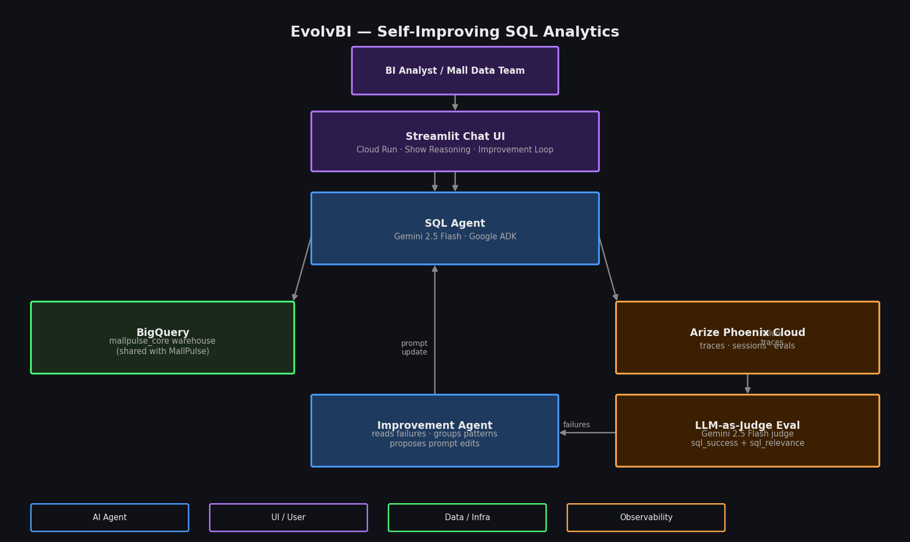

# 🔬 EvolvBI

**Self-Improving SQL Analytics for Retail Data**

EvolvBI is a natural-language SQL assistant that gets smarter by learning from its own mistakes. Ask questions about mall performance data, watch every interaction traced through Arize Phoenix, then trigger a self-improvement loop that reads failure patterns and proposes targeted prompt edits — live, in the browser.

**🔗 Live demo:** https://evolvbi-3f3swnt3qq-uc.a.run.app

> ⚠️ **All data is completely synthetic and generated for demonstration purposes only.** Revenue figures, transaction counts, tenant names, lease terms, and foot traffic are fictitious and do not represent any real business.

---

## What it does

| Feature | Detail |
|---|---|
| **Natural-language SQL** | Ask questions in plain English; the agent writes and runs BigQuery SQL |
| **Show reasoning** | Expand any answer to see the exact SQL query + Phoenix trace link |
| **ARIMA forecasts** | Forward-looking questions call a BigQuery ML `ARIMA_PLUS` model — no last-year-minus-X% guesswork |
| **Three-eval pipeline** | Every trace scored by `sql_success` (code), `sql_relevance` (Gemini judge), and `sql_grounding` (code) |
| **Improvement loop** | One click reads failure traces, groups patterns, and proposes one prompt edit per pattern |
| **Live prompt diff** | Proposed edits rendered as a red/green diff — the agent rewriting its own instructions |
| **Durable prompts** | Applied edits persist to a BigQuery `prompt_store` table, so improvements survive restarts |

### Example questions (the app's built-in quick questions)

- *"Which mall had the highest revenue last month?"*
- *"What are the top 5 categories by total sales last quarter?"*
- *"How many unique customers shopped at Valley Fair last month?"* — answered with `COUNT(DISTINCT customer_id)`
- *"Which tenant had the lowest revenue at Stanford Shopping Center last quarter?"*
- *"Which month had the highest sales across all malls this year?"*
- *"What is the average basket size per category?"* — `SUM(revenue) / SUM(transactions)`, never average-of-averages

---

## The three evals

The eval pipeline is what makes self-improvement possible — it turns every answer into a labelled, inspectable signal in Phoenix:

| Eval | Kind | Catches |
|---|---|---|
| `sql_success` | Code | The SQL tool errored or returned nothing |
| `sql_relevance` | LLM (Gemini judge) | The answer doesn't actually address the question |
| `sql_grounding` | Code | **Fabricated numbers** — figures in the answer that don't trace back to the query results (e.g. a hallucinated "$1.6B" when the query returned millions) |

`sql_grounding` exists because the first two can both pass a confidently-wrong answer: the SQL ran and the reply is on-topic, but the headline number was invented. Grounding closes that gap.

---

## Architecture



The self-improvement loop:
1. User asks a question → SQL Agent queries BigQuery (or calls the ARIMA forecast tool for forward-looking questions).
2. Every interaction is traced to **Arize Phoenix Cloud**.
3. `evals/run_evals.py` scores each trace with the three evals above.
4. Failed traces — including **grounding failures** — accumulate in Phoenix with labels and explanations.
5. The **Improvement Agent** reads the failures, groups them into 2–3 patterns, and proposes one surgical prompt edit per pattern.
6. User reviews the red/green diff and applies — the evolved prompt is written to the BigQuery `prompt_store` and the agent is rebuilt live. The next run uses the improved instructions.

---

## Tech stack

| Layer | Technology |
|---|---|
| **AI agents** | Google ADK 1.34, Gemini 3 Flash Preview (Vertex AI global; 2.5 Flash fallback) |
| **Tracing** | Arize Phoenix Cloud (OpenInference instrumentation for ADK) |
| **Evaluation** | `sql_success` + `sql_grounding` (code) and `sql_relevance` (Gemini-as-judge, Google-only per rules) |
| **Forecasting** | BigQuery ML `ARIMA_PLUS` via the `forecast_mall_revenue` tool |
| **Prompt store** | BigQuery `prompt_store` table — durable, versioned system-prompt history |
| **Data warehouse** | BigQuery (`goldengate_core` — shared with GoldenGate Retail AI) |
| **UI** | Streamlit — chat + reasoning panel + live prompt diff |
| **Deployment** | Cloud Run |

---

## Dataset

Shared with [GoldenGate Retail AI](https://github.com/heemaniar/goldengate-retail-ai): ~1.5M synthetic transactions across **13 Bay Area shopping malls** (Jan 2020 – present, refreshed daily), covering San Jose, Palo Alto, San Francisco, Emeryville, San Mateo, Pleasanton, Walnut Creek, Concord, Milpitas, and Livermore.

| Table | Contents |
|---|---|
| `dim_mall` | 13 Bay Area malls with tier, sq ft, coordinates |
| `dim_tenant` | Tenants with SCD Type 2 history (replacements tracked) |
| `dim_lease` | Monthly base rent + rent-as-%-of-sales per tenant |
| `fact_transactions` | Invoice-level sales (USD) with category, payment method |
| `fact_foot_traffic` | Hourly estimated visits per mall |
| `fact_weather` | Daily temperature, precipitation, weather code per mall |
| `agg_mall_daily` | Pre-aggregated daily revenue + transactions per mall |
| `agg_tenant_daily` | Pre-aggregated daily revenue + basket per tenant |
| `revenue_forecast` | BigQuery ML `ARIMA_PLUS` model (powers the forecast tool) |
| `prompt_store` | Persisted system-prompt versions from the improvement loop |

Key real-world events modeled: COVID-19 shutdown (Mar–Jun 2020), Bay Area wildfire smoke (Aug–Sep 2020), tech layoffs (Nov 2022–Dec 2023), Westfield SF Centre closure (Aug 2023), and Bay Area recovery (2024–2026).

---

## Running locally

**Prerequisites:** Python 3.11+, `gcloud` CLI authenticated, a GCP project with BigQuery + Vertex AI enabled, and an Arize Phoenix Cloud account.

```bash
git clone https://github.com/heemaniar/evolvbi.git
cd evolvbi

python3 -m venv .venv
source .venv/bin/activate
pip install -r requirements.txt

cp .env.example .env
# Fill in: PHOENIX_API_KEY, PHOENIX_COLLECTOR_ENDPOINT, GOOGLE_CLOUD_PROJECT
# (defaults to Gemini 3 Flash Preview on the Vertex AI global endpoint)

gcloud auth application-default login

streamlit run streamlit_app.py
# → http://localhost:8501
```

---

## Running the eval + improvement pipeline

```bash
# Score recent traces in Phoenix with all three evals
python evals/run_evals.py

# Run the improvement loop (also triggered from the Streamlit UI)
python agents/improver.py
```

The improvement loop reads scored failures (including grounding failures) from Phoenix, proposes prompt edits, and — when applied in the UI — persists the new prompt to the BigQuery `prompt_store`.

---

## Deploying to Cloud Run

```bash
bash deploy_cloudrun.sh
```

---

## Project structure

```
evolvbi/
├── agents/
│   ├── sql_agent.py      # SQL agent (query + ARIMA forecast tools) + Phoenix instrumentation
│   └── improver.py       # Reads failures, proposes prompt edits
├── evals/
│   └── run_evals.py      # sql_success + sql_grounding (CODE) + sql_relevance (LLM) evals
├── tools/
│   └── bigquery_tools.py # query_warehouse + forecast_mall_revenue (ARIMA_PLUS)
├── streamlit_app.py      # Chat UI + reasoning panel + improvement loop + prompt diff
├── app.py                # Headless CLI runner
├── deploy_cloudrun.sh    # Cloud Run one-command deploy
├── Dockerfile
└── requirements.txt
```

---

## Hackathon

Built for the **[Google Cloud Rapid Agent Hackathon](https://googlecloudagents.devpost.com/)** — Arize Phoenix track.

**Submission deadline:** June 11, 2026

---

## License

MIT — see [LICENSE](LICENSE)
